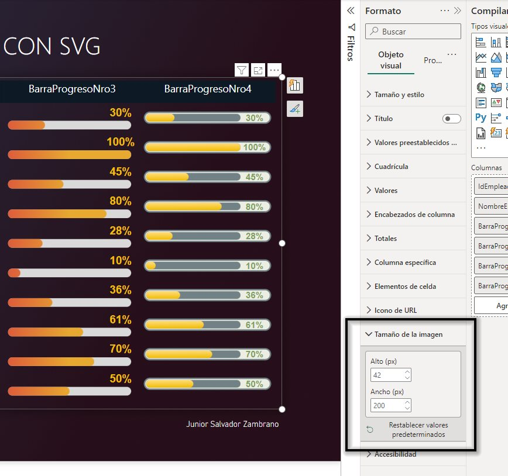

# Barras de progreso con SVG para tablas de Power BI


A continuación muestro cómo usar archivos SVG (Gráficos Vectoriales Escalables) para crear barras de progreso en tablas de Power BI.

La flexibilidad del SVG permite editar el código que lo compone (similar a las etiquetas de HTML) para dinamizar su contenido, posición, tamaño, color, etc., y así crear visualizaciones más atractivas y personalizadas.

## Instalación

1. Descarga el archivo `plantillas_barras_de_progreso.pbix` que tiene las 4 versiones de barras de progreso.

2. Copia el código DAX de la medida de la barra de progreso que quieras usar, luego crea una nueva medida en tu informe y pega el código. Las medidas disponibles son: `BarraProgresoNro1`, `BarraProgresoNro2`, `BarraProgresoNro3` y `BarraProgresoNro4`.

3. Edita la medida para que se ajuste a tus necesidades. Solo debes modificar la variable `ValorPorcentaje` por el tipo de cálculo que requieras. Considera que los valores de `ValorPorcentaje` deben estar entre 0 y 100.

    ```dax
    VAR ValorPorcentaje = AVERAGE(tabla_empleados[Avance])
    ```

4. Una vez creada la medida, es importante establecer su clasificación como *'Dirección URL de la imagen'* en la opción *'Categoría de datos'*, sino en el objeto visual verás el código SVG en lugar de su representación gráfica.

    

5. Usa la medida como columna en un objeto de tabla.

6. Finalmente, con el objeto visual seleccionado ajusta la proporción del SVG en *'Tamaño de la imagen'* dentro de *'Formato'*. La dimensión de los 4 archivos SVG que diseñé es de 270 (ancho) x 57 (alto), por tanto mantenlo en una proporción equivalente para evitar distorsiones.

    

## Opcional: ¿Puedo crear mis propios diseños SVG?

Por supuesto, recomiendo **FIGMA** que es la herramienta donde he creado los 4 diseños anteriores. Es una herramienta online de diseño gráfico y prototipado muy intuitiva donde podrás exportar tus gráficos directamente en formato .SVG, luego podrás manipular sus códigos en alguno de los muchos editores online de código para SVG o como en mi caso con Visual Studio Code junto a una extensión. A continuación dejo los enlaces de esas herramientas:

* Creación de gráficos SVG: [FIGMA](https://www.figma.com/)

    

* Editor de código SVG (online): [SVGViewer](https://www.svgviewer.dev/)
    
    

* Editor de código (local): [Visual Studio Code](https://code.visualstudio.com/) y extensión [SVG by jock](https://marketplace.visualstudio.com/items?itemName=jock.svg)

    

### Consideraciones al crear gráficos SVG para Power BI

1. Lo más sencillo para abrir un archivo .SVG y ver su código es usar el *Bloc de notas*.

2. ¿Se tiene que editar el código del .SVG exportado por FIGMA? **Sí**. Es indispensable reemplazar las comillas dobles ("") por comillas simples('') en TODO el código, si no lo haces obtendrás un error en Power BI.

    Correcto: ✅
    ```SVG
    <svg width='270' height='57' viewBox='0 0 200 57' fill='none' xmlns='http://www.w3.org/2000/svg'>
        ... el código de tu gráfico SVG ...
    </svg>
    ```

    Incorrecto: ❌
    ```SVG
    <svg width="270" height="57" viewBox="0 0 200 57" fill="none" xmlns="http://www.w3.org/2000/svg">
        ... el código de tu gráfico SVG ...
    </svg>
    ```

3. Si vas a dinamizar texto (como en nuestro caso), no recomiendo crear los textos del SVG en FIGMA ni en algún otro editor visual, mejor usa la etiqueta `<text>` directamente en el código. El motivo es porque los editores visuales suelen tratar el texto como una forma compleja por tener muchas curvas y lo crean codificando una etiqueta `<path>` con el atributo `d=` en lugar de un texto simple. Créeme que no te gustará editar el código de una etiqueta *path*, además no podremos dinamizarlo tan fácil.

    A continuación un ejemplo de cómo se ve un texto simple con `<text>` y uno codificado en un `<path>`, ambos con el mismo contenido:

    * Etiqueta `<text>`, sencillo y fácilmente editable: ✅
        ```SVG
        <text x='235' y='16' dominant-baseline='middle' text-anchor='middle' style='font: bold 24px Arial; fill: #27A2CD'>50%</text>
        ```

    * Etiqueta `<path>`, complejo y difícil de editar: ❌
        ```SVG
        <path d='M6.89666 18.2386C5.7603 18.2386 4.74325 18.0256 3.84553 17.5994C2.9478 17.1676 2.23473 16.5767 1.70632 15.8267C1.18359 15.0767 0.905185 14.2187 0.871094 13.2528H3.93928C3.99609 13.9687 4.30575 14.554 4.86825 15.0085C5.43075 15.4574 6.10689 15.6818 6.89666 15.6818C7.51598 15.6818 8.06712 15.5398 8.55007 15.2557C9.03303 14.9716 9.41371 14.5767 9.69212 14.071C9.97053 13.5653 10.1069 12.9886 10.1012 12.3409C10.1069 11.6818 9.96768 11.0966 9.68359 10.5852C9.3995 10.0739 9.0103 9.6733 8.51598 9.38352C8.02166 9.08807 7.45348 8.94034 6.81143 8.94034C6.28871 8.93466 5.7745 9.03125 5.26882 9.23011C4.76314 9.42898 4.36257 9.69034 4.06712 10.0142L1.212 9.54545L2.12393 0.545454H12.2489V3.1875H4.74041L4.23757 7.81534H4.33984C4.66371 7.43466 5.12109 7.11932 5.712 6.86932C6.30291 6.61364 6.95064 6.4858 7.65518 6.4858C8.712 6.4858 9.65518 6.7358 10.4847 7.2358C11.3143 7.73011 11.9677 8.41193 12.445 9.28125C12.9222 10.1506 13.1609 11.1449 13.1609 12.2642C13.1609 13.4176 12.8938 14.446 12.3597 15.3494C11.8313 16.2472 11.0955 16.9545 10.1523 17.4716C9.21484 17.983 8.12962 18.2386 6.89666 18.2386ZM22.4677 18.3324C21.0643 18.3324 19.8597 17.9773 18.854 17.267C17.854 16.5511 17.0842 15.5199 16.5444 14.1733C16.0103 12.821 15.7433 11.1932 15.7433 9.28977C15.7489 7.38636 16.0188 5.76705 16.5529 4.43182C17.0927 3.09091 17.8626 2.06818 18.8626 1.36364C19.8683 0.659091 21.07 0.306818 22.4677 0.306818C23.8654 0.306818 25.0671 0.659091 26.0728 1.36364C27.0785 2.06818 27.8484 3.09091 28.3825 4.43182C28.9222 5.77273 29.1921 7.39205 29.1921 9.28977C29.1921 11.1989 28.9222 12.8295 28.3825 14.1818C27.8484 15.5284 27.0785 16.5568 26.0728 17.267C25.0728 17.9773 23.8711 18.3324 22.4677 18.3324ZM22.4677 15.6648C23.5586 15.6648 24.4194 15.1278 25.0501 14.054C25.6864 12.9744 26.0046 11.3864 26.0046 9.28977C26.0046 7.90341 25.8597 6.73864 25.57 5.79545C25.2802 4.85227 24.8711 4.14205 24.3427 3.66477C23.8143 3.18182 23.1893 2.94034 22.4677 2.94034C21.3825 2.94034 20.5245 3.48011 19.8938 4.55966C19.2631 5.63352 18.945 7.21023 18.9393 9.28977C18.9336 10.6818 19.0728 11.8523 19.3569 12.8011C19.6467 13.75 20.0558 14.4659 20.5842 14.9489C21.1126 15.4261 21.7404 15.6648 22.4677 15.6648ZM41.3562 14.7273V13.8068C41.3562 13.1307 41.4982 12.5085 41.7823 11.9403C42.0721 11.3722 42.4925 10.9148 43.0437 10.5682C43.5948 10.2216 44.2624 10.0483 45.0465 10.0483C45.8533 10.0483 46.5295 10.2216 47.0749 10.5682C47.6204 10.9091 48.0323 11.3636 48.3107 11.9318C48.5948 12.5 48.7369 13.125 48.7369 13.8068V14.7273C48.7369 15.4034 48.5948 16.0256 48.3107 16.5938C48.0266 17.1619 47.609 17.6193 47.0579 17.9659C46.5124 18.3125 45.842 18.4858 45.0465 18.4858C44.2511 18.4858 43.5778 18.3125 43.0266 17.9659C42.4755 17.6193 42.0579 17.1619 41.7738 16.5938C41.4954 16.0256 41.3562 15.4034 41.3562 14.7273ZM43.5806 13.8068V14.7273C43.5806 15.1761 43.6886 15.5881 43.9045 15.9631C44.1204 16.3381 44.5011 16.5256 45.0465 16.5256C45.5977 16.5256 45.9755 16.3409 46.18 15.9716C46.3903 15.5966 46.4954 15.1818 46.4954 14.7273V13.8068C46.4954 13.3523 46.396 12.9375 46.1971 12.5625C45.9982 12.1818 45.6147 11.9915 45.0465 11.9915C44.5124 11.9915 44.1346 12.1818 43.913 12.5625C43.6914 12.9375 43.5806 13.3523 43.5806 13.8068ZM32.484 4.73864V3.81818C32.484 3.13636 32.6289 2.51136 32.9187 1.94318C33.2085 1.375 33.6289 0.920454 34.18 0.579545C34.7312 0.232954 35.3988 0.0596581 36.1829 0.0596581C36.984 0.0596581 37.6573 0.232954 38.2028 0.579545C38.7539 0.920454 39.1687 1.375 39.4471 1.94318C39.7255 2.51136 39.8647 3.13636 39.8647 3.81818V4.73864C39.8647 5.42045 39.7227 6.04545 39.4386 6.61364C39.1602 7.17614 38.7454 7.62784 38.1942 7.96875C37.6431 8.30966 36.9727 8.48011 36.1829 8.48011C35.3817 8.48011 34.7056 8.30966 34.1545 7.96875C33.609 7.62784 33.1942 7.1733 32.9102 6.60511C32.6261 6.03693 32.484 5.41477 32.484 4.73864ZM34.7255 3.81818V4.73864C34.7255 5.19318 34.8306 5.60795 35.0408 5.98295C35.2567 6.35227 35.6374 6.53693 36.1829 6.53693C36.7283 6.53693 37.1033 6.35227 37.3079 5.98295C37.5181 5.60795 37.6232 5.19318 37.6232 4.73864V3.81818C37.6232 3.36364 37.5238 2.94886 37.3249 2.57386C37.1261 2.19318 36.7454 2.00284 36.1829 2.00284C35.6431 2.00284 35.2653 2.19318 35.0494 2.57386C34.8335 2.95455 34.7255 3.36932 34.7255 3.81818ZM33.4556 18L45.4556 0.545454H47.5863L35.5863 18H33.4556Z' fill='#27A2CD'/>
        ```

        Con `<text>` es más sencillo editar el contenido del texto, su estilo (`style=`) y posición (`x=` e `y=`).

## Aviso legal

Este tutorial incluye el uso de software privativo que está sujeto a derechos de autor y otras restricciones. Las marcas registradas y nombres comerciales de terceros mencionados en este tutorial son propiedad de sus respectivos propietarios. La inclusión de software privativo se realiza únicamente con fines educativos y de demostración.

Consulta la documentación oficial del software para obtener información detallada sobre las licencias y los términos de uso. Es responsabilidad del usuario garantizar que cumple con todas las leyes de derechos de autor y licencias aplicables al utilizar el software privativo mencionado en este tutorial.

El autor y los contribuyentes de este tutorial no asumen ninguna responsabilidad por el uso que se haga del software privativo mencionado en este tutorial.

## Licencia

Este proyecto está bajo la licencia Creative Commons Attribution 4.0 International (CC-BY-4.0). Eres libre de compartir, copiar, distribuir y adaptar el trabajo para cualquier propósito, incluso comercialmente, siempre y cuando des crédito adecuado al autor original. No se ofrece garantía. Al usar este material, aceptas los términos de la licencia y reconoces la atribución adecuada al autor original. Puedes ver más detalles de la licencia en [CC-BY-4.0](https://creativecommons.org/licenses/by/4.0/).